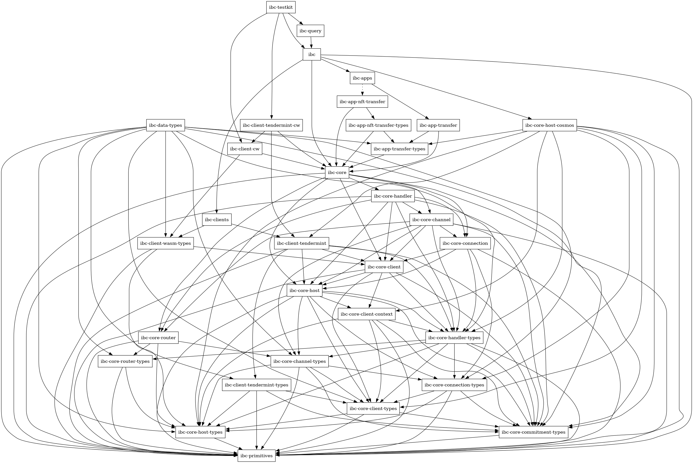
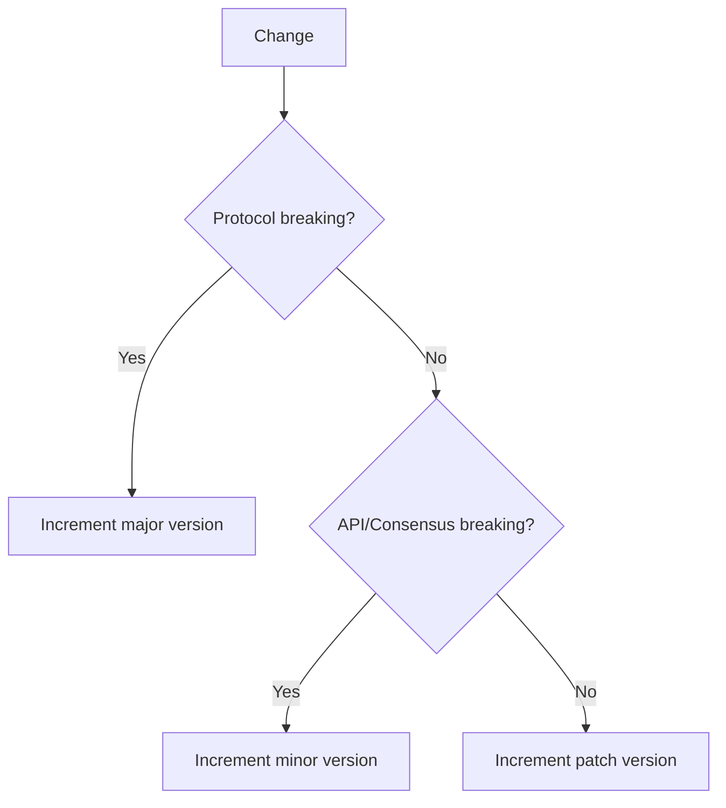

## Releases

Currently, the ibc-rs repository contains multiple workspaces that each require
a separate release via PR. When performing an ibc-rs, each of the following
workspaces should be released:

- [ ] The `ibc-derive` crate
- [ ] The "main" ibc-rs workspace, which contains `ibc-core`, `ibc-apps`,
      `ibc-primitives`, `ibc-query`, `ibc-clients`, `ibc-data-types`, and
      `ibc-testkit`

### ibc-derive

As `ibc-derive` is an independent dependency of ibc-rs, if any changes were
introduced to this crate, then a new version needs to be released prior to
releasing a new version of ibc-rs. This is done by:

1. Bumping the version of `ibc-derive` in `crates/ibc-derive/Cargo.toml`
2. Running `cargo publish -p ibc-derive` to publish the crate to crates.io
3. Update the version of `ibc-derive` in the `Cargo.toml` of each crate that depends on it

If no changes were introduced since the last release of ibc-rs, then there is no
need to publish a new version of this crate.

### ibc-rs

The release process for the main ibc-rs workspace is as follows:

1. In a new branch `release/vX.Y.Z`, update the [changelog](./CHANGELOG.md) to
   reflect and summarize all changes in the release. This involves:
   1. Running `unclog build -u` and copy-pasting the output at the top of the
      `CHANGELOG.md` file, making sure to update the header with the new
      version.
   2. Running `unclog release --editor <editor> vX.Y.Z` to create a summary of
      all the changes in this release.
      1. Your text editor will open. Write the release summary, and close the
         editor. Make sure to include a comment on whether the release contains
         consensus-breaking changes.
      2. Add this same summary to `CHANGELOG.md` as well.
   3. Committing the updated `CHANGELOG.md` file and `.changelog` directory to
      the repo.
2. Push this to a branch `release/vX.Y.Z` according to the version number of the
   anticipated release (e.g. `release/v0.18.0`) and open a **draft PR**.
3. Bump the versions of all crates to the new version in their `Cargo.toml` and
   in the root `Cargo.toml` as well, and push these changes to the release PR.
   - Verify that there is no dev-dependency among the workspace crates. This is
     important, as `cargo-release` ignores dev-dependency edges. You may use
     `cargo-depgraph`:
     ```sh
     cargo depgraph --all-features --workspace-only --dev-deps | dot -Tpng > graph.png
     ```
     The command will generate a graph similar to this:
      The dev dependencies are colored with
     blue arrows. Currently, there are no blue arrows, i.e. there is no dev
     dependency among the IBC crates. It is advised to avoid any dev dependency
     because of release order complication (except maybe inside `ibc-testkit`,
     as it is the top crate that depends on `ibc` crate and no other crate
     depends on it).
   - To resolve such a situation, the dev dependencies other than `ibc-testkit`
     can be manually released to crates.io first so that the subsequent crates
     that depend on them can then be released via the release process. For
     instructions on how to release a crate on crates.io, refer
     [here][publishing].
4. Validate the number of new and existing crates that need to be released via
   CI.
   1. crates.io imposes a [rate limit][crates-io-rate-limit] of publishing 1
      crate per minute after a burst of 10 crates.
   2. Also, [`cargo-release`][cargo-release-rate-limit] rejects publishing more
      than 5 new crates or 30 existing crates by default. If we need to publish
      more than these limits, we need to update `release.toml` at workspace
      root.
5. Mark the PR as **Ready for Review** and incorporate feedback on the release.
   Once approved, merge the PR.
6. Checkout the `main` and pull it with
   `git checkout main && git pull origin main`.
7. Create a signed tag `git tag -s -a vX.Y.Z`. In the tag message, write the
   version and the link to the corresponding section of the changelog. Then push
   the tag to GitHub with `git push origin vX.Y.Z`.
   - The [release workflow][release.yaml] will run the `cargo release --execute`
     command in a CI worker.
8. If some crates have not been released, check the cause of the failure and
    act accordingly:
    1. In case of intermittent problems with the registry, try `cargo release`
       locally to publish any missing crates from this release. This step
       requires the appropriate privileges to push crates to [crates.io].
    2. If there is any new crate published locally, add
       [ibcbot](https://crates.io/users/ibcbot) to its owners' list.
    3. In case problems arise from the source files, fix them, bump a new patch
       version (e.g. `v0.48.1`) and repeat the process with its corresponding
       new tag.
9. Once the tag is pushed, wait for the CI bot to create a GitHub release, then
    update the release description and append:
    `[📖CHANGELOG](https://github.com/cosmos/ibc-rs/blob/main/CHANGELOG.md#vXYZ)`

### Communications (non-technical) release pipeline

- Notify the communications team about the pending release and prepare an
  announcement.
- Coordinate with other organizations that are active in IBC development (e.g.,
  Interchain) and keep them in the loop.

All done! 🎉

## Versioning

`ibc-rs` uses a modified form of [semantic versioning][semver] and adheres to
the `vMAJOR.MINOR.PATCH` structure as follows:

- _Major_ version bumps are reserved for protocol breaking changes that require
  users to perform a coordinated upgrade to use the new version of `ibc-rs`.
- _Minor_ version bumps are reserved for new features and/or substantial changes
  that cause API and/or consensus breakage.
- _Patch_ version bumps are reserved for bug/security fixes that are not API
  breaking.



Note that, this is slightly different from
[`ibc-go`'s versioning policy][ibc-go-version-policy].

[crates.io]: https://crates.io
[release.yaml]: https://github.com/cosmos/ibc-rs/blob/main/.github/workflows/release.yaml
[semver]: https://semver.org
[ibc-go-version-policy]: https://github.com/cosmos/ibc-go/blob/main/RELEASES.md#releases
[crates-io-rate-limit]: https://github.com/rust-lang/crates.io/pull/1596
[cargo-release-rate-limit]: https://github.com/crate-ci/cargo-release/blob/54ad949/src/config.rs#L493-L498
[publishing]: https://doc.rust-lang.org/cargo/reference/publishing.html
