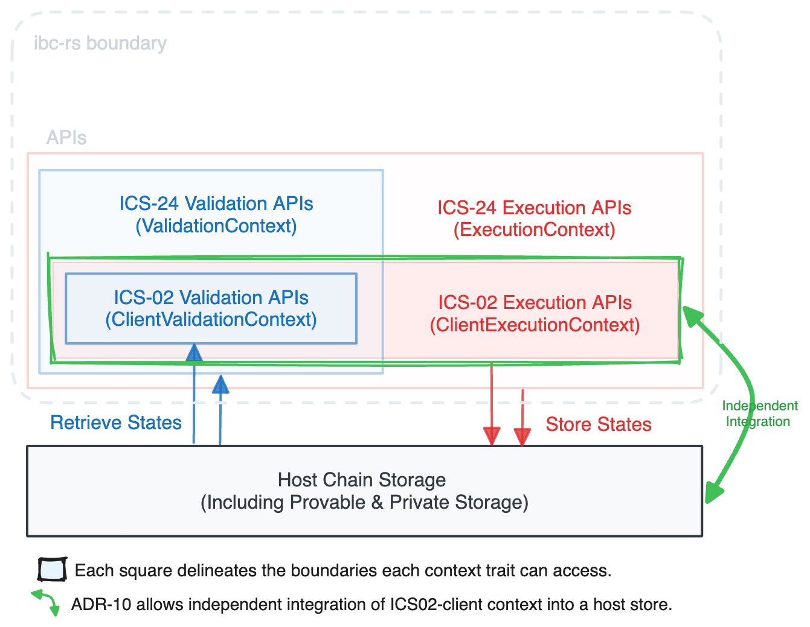

# ADR 010: ENABLE STANDALONE ICS-02 INTEGRATION

## Changelog

- 2024-03-05: Draft Proposed

## Status

Accepted

## Context

In ADR-07, we previously granted light client developers the flexibility to
introduce custom APIs to the client contexts. This decision was made to
accommodate potential scenarios where not all methods required by every future
light client might be present in the extensive
[`ValidationContext`](https://github.com/cosmos/ibc-rs/blob/4421b0dcd6eab6c914b8c5a7d45817b1edb6b2ce/ibc-core/ics24-host/src/context.rs#L31)
or
[`ExecutionContext`](https://github.com/cosmos/ibc-rs/blob/4421b0dcd6eab6c914b8c5a7d45817b1edb6b2ce/ibc-core/ics24-host/src/context.rs#L168)
traits.

In this ADR, while retaining that capability, we propose a reorganization of
client-related APIs by consolidating them under the ICS-02 client validation and
execution contexts. While the main top-level context traits in ICS-24
(`ibc-core-host` crate) will still have access to these APIs through the
existing accessor
[`get_client_validation_context()`](https://github.com/cosmos/ibc-rs/blob/4421b0dcd6eab6c914b8c5a7d45817b1edb6b2ce/ibc-core/ics24-host/src/context.rs#L38)
and
[`get_client_execution_context()`](https://github.com/cosmos/ibc-rs/blob/4421b0dcd6eab6c914b8c5a7d45817b1edb6b2ce/ibc-core/ics24-host/src/context.rs#L170)
methods.

As a result of this ADR, client relevant methods, namely **`client_state()`**
and **`consensus_state()`**, will be extracted from the large ICS-24 validation
and execution context traits. Instead, they will find their new home under the
ICS-02
[`ClientValidationContext`](https://github.com/cosmos/ibc-rs/blob/caee889ad308a4aac3f9905de9cdda76c5533cfb/ibc-core/ics02-client/context/src/context.rs#L14)
and
[`ClientExecutionContext`](https://github.com/cosmos/ibc-rs/blob/caee889ad308a4aac3f9905de9cdda76c5533cfb/ibc-core/ics02-client/context/src/context.rs#L32)
traits.

## Objectives

The primary objective is to enhance the delineation of the APIs that connect
ibc-rs to the host’s storage, offering a more modular approach that allows
developers who wish to integrate only the implemented client states under the
ibc-rs to their IBC infra. In other words, this enhancement does not mandate
hosts to implement all the IBC layers, such as connection, channel, or any of
the IBC applications, when only light client support is required.

As a result, this ADR sets the stage for several potential use cases, including:

1. **Streamlines CosmWasm light client implementation**
    - Since the refined structure allows for the independent integration of
      ICS-02 client traits into the storage, it becomes straightforward to
      implement light clients living in ibc-rs as CosmWasm contracts, which
      empowers simpler Wasm client integration with ibc-go driven chains.

2. **Enables client integration with various IBC implementations**
    - Any IBC implementation, whether it is based on ibc-rs or a fork of ibc-rs,
      will have this capability to incorporate the latest light client
      implementations by ibc-rs. So that even if an IBC implementation diverges
      from the ibc-rs framework, hosts can benefit from the latest version of
      light client implementation. This is important from the security
      standpoint, broadens the applicability of ibc-rs, and facilitates
      collaboration with other IBC-adjacent solutions.

As part of this ADR and to minimize breaking changes later, we aim to address
the following client-relevant API deficiencies as well:

1. **Refining access to validation vs execution methods**
    - So far, unauthorized access to client execution methods [has been
      possible](https://github.com/cosmos/ibc-rs/blob/4421b0dcd6eab6c914b8c5a7d45817b1edb6b2ce/ibc-core/ics24-host/src/context.rs#L33)
      under the `ValidationContext`. This will be rectified to ensure that only
      the `ClientState` validation method is callable within the validation
      contexts. This enhances the precision of access control, aligning it more
      closely with the intended functionality.

2. **Bringing more clarity to how context APIs are related**
    - The ambiguous relationship between the main context APIs at ICS-24, ICS-02
      client APIs, and client-specific APIs can get cleared. This ADR aims for a
      more transparent relationship between these contexts, making it easier to
      understand their interactions and roles. For instance some client relevant
      methods are located under the client contexts, while others are under the
      main (ICS-24) contexts.

3. **Minimizing associated types’ declarations**
    - Our current APIs pose a challenge by requiring users to introduce multiple
      yet the same associated types like `AnyClientState`, `AnyConsensusState`,
      etc across different layers. A more efficient solution involves
      introducing such types in fewer places, providing better access to the
      traits across different layers. However, it's worth acknowledging that an
      ideal solution might entail utilizing features from forthcoming stable
      versions of Rust. This would enable us to leverage the advantages provided
      by either
      [associated_type_bounds](https://rust-lang.github.io/rfcs/2289-associated-type-bounds.html),
      [associated_type_defaults](https://rust-lang.github.io/rfcs/2532-associated-type-defaults.html),
      or
      [implied_bounds](https://rust-lang.github.io/rfcs/2089-implied-bounds.html)
      capabilities.

## Decision

Here is a high-level diagram that illustrates the optimal boundaries for each
context trait, specifying the scope of access by each of these contexts. In
addition, the classification of APIs should be such that they allow the
independent integration of light client implementations.

<div style="text-align: center;">
  
</div>

The primary `ValidationContext` and `ExecutionContext` traits at the ICS-24 host
level will be restructured as follows, only having sufficient access to
respective ICS-02 client contexts, without caring about the types or methods
associated with client or consensus states of counterparty chains. It is
noteworthy that, to better illustrate the desired outcome from the current
state, the code snippets below are in the `diff` format.

```diff
pub trait ValidationContext {
    type V: ClientValidationContext;
+    type HostClientState: ClientStateValidation<Self::V>;
+    type HostConsensusState: ConsensusState;
-    type E: ClientExecutionContext;
-    type AnyConsensusState: ConsensusState;
-    type AnyClientState: ClientState<Self::V, Self::E>;

    /// Retrieve the context that implements all clients' `ValidationContext`.
    fn get_client_validation_context(&self) -> &Self::V;

     // This method will be removed and replaced by a `ClientStateDecoder` trait that will encapsulate the ability to decode a client state from an `Any`
-    fn decode_client_state(&self, client_state: Any) -> Result<Self::AnyClientState, ContextError>;

-    fn client_state(&self, client_id: &ClientId) -> Result<Self::AnyClientState, ContextError>;

-    fn consensus_state(
-        &self,
-        client_cons_state_path: &ClientConsensusStatePath,
-    ) -> Result<Self::AnyConsensusState, ContextError>;

    fn host_consensus_state(
        &self,
        height: &Height,
-    ) -> Result<Self::AnyConsensusState, ContextError>;
+    ) -> Result<Self::HostConsensusState, ContextError>;

    fn validate_self_client(
        &self,
-        client_state_of_host_on_counterparty: Any,
+        client_state_of_host_on_counterparty: Self::HostClientState,
    ) -> Result<(), ContextError>;

    ... // other methods
}

pub trait ExecutionContext: ValidationContext {
+    type E: ClientExecutionContext;

    /// Retrieve the context that implements all clients' `ExecutionContext`.
    fn get_client_execution_context(&mut self) -> &mut Self::E;

    ... // other methods

/// Convenient type aliases
+ pub type ClientStateRef<Ctx> =
+    <<Ctx as ValidationContext>::V as ClientValidationContext>::ClientStateRef;

+ pub type ClientStateMut<Ctx> =
+    <<Ctx as ExecutionContext>::E as ClientExecutionContext>::ClientStateMut;

+ pub type ConsensusStateRef<Ctx> =
+    <<Ctx as ValidationContext>::V as ClientValidationContext>::ConsensusStateRef;
}
```

We should also highlight that ICS-02 houses various types, APIs and
implementations essential for enabling **light clients of counterparty chains
operating on the host chain**. Therefore, the `host_consensus_state()` and
`validate_self_client()` methods, though initially appearing to be ICS-02
specific, play a crucial role in the connection handshake validating receiving
datagrams against the client and consensus states of the host.

In this ADR, these methods will continue to be housed under the main context
traits. However, we will explicitly define the accepted types for these methods
as `HostClientState` and `HostConsensusState`. This refinement aims for more
clarity and will optimize the decoding process, removing an unnecessary layer of
decoding during information retrieval. Previously, the decoding process for
these methods involved obtaining `AnyClientState` and `AnyConsensusState` types
and then converting them into the concrete `HostClientState` and
`HostConsensusState` types.

Following the aforementioned points, in the ICS-02 level, the
`ClientValidationContext` and `ClientExecutionContext` traits will be
restructured as follows, containing all the client relevant methods and types:

```diff
pub trait ClientValidationContext: Sized {
     // Given that we will be dropping `decode_client_state()` method,
     // the client state type introduced here should have implemented `TryFrom<Any>` and `Into<Any>` traits.
+    type ClientStateRef: ClientStateValidation<Self>;
+    type ConsensusStateRef: ConsensusState;

+    fn client_state(&self, client_id: &ClientId) -> Result<Self::ClientStateRef, ContextError>;

+    fn consensus_state(
+        &self,
+        client_cons_state_path: &ClientConsensusStatePath,
+    ) -> Result<Self::ConsensusStateRef, ContextError>;

    fn client_update_meta(
        &self,
        client_id: &ClientId,
        height: &Height,
    ) -> Result<(Timestamp, Height), ContextError>;
}

pub trait ClientExecutionContext:
+    ClientValidationContext<ClientStateRef = Self::ClientStateMut>
{
-    type V: ClientValidationContext;
-    type AnyClientState: ClientState<Self::V, Self>;
-    type AnyConsensusState: ConsensusState;
+    type ClientStateMut: ClientStateExecution<Self>;

+    fn client_state_mut(&self, client_id: &ClientId) -> Result<Self::ClientStateMut, ContextError> {
+        self.client_state(client_id)
+    }

    fn store_client_state(
        &mut self,
        client_state_path: ClientStatePath,
        client_state: Self::ClientStateMut,
    ) -> Result<(), ContextError>;

    fn store_consensus_state(
        &mut self,
        consensus_state_path: ClientConsensusStatePath,
        consensus_state: Self::ConsensusStateRef,
    ) -> Result<(), ContextError>;

    fn delete_consensus_state(
        &mut self,
        consensus_state_path: ClientConsensusStatePath,
    ) -> Result<(), ContextError>;

    fn store_update_meta(
        &mut self,
        client_id: ClientId,
        height: Height,
        host_timestamp: Timestamp,
        host_height: Height,
    ) -> Result<(), ContextError>;

    fn delete_update_meta(
        &mut self,
        client_id: ClientId,
        height: Height,
    ) -> Result<(), ContextError>;
}
```

The introduction of the `ClientStateMut` associated type in addition to the
`ClientStateRef` became necessary to tackle the limitation that the
`ClientState` retrieved from the regular `client_state()` method provides access
only to validation methods. However, in `execute` handlers, there are scenarios
(like
[here](https://github.com/cosmos/ibc-rs/blob/f272f30e0f773d85a99fc553b75d41f9f768d5c5/ibc-core/ics02-client/src/handler/update_client.rs#L54))
where access to the execution methods of the client state is required. We aim to
simplify the user experience by providing a default implementation, relieving
users from the need to implement the `client_state_mut` method.

Also, the introduction of `<ClientStateRef = Self::ClientStateMut>` is prompted
by the need to address the characteristics of concrete `ClientState`
definitions. For instance, in the case of ICS-07, such as `TmClientState`, the
struct definition can't be split into two fragments, one for validation and the
other for execution. Therefore, contexts implementing `ClientExecutionContext`
must introduce a `ClientStateMut` type the same as `ClientStateRef`.

With the mentioned classification, we can now streamline ICS-07 specific APIs,
eliminating the requirement for implementing a redundant `consensus_state()`
method. For the sake of simplification, we can remove the `CommonContext` trait
and consolidate everything under the `ExtClientValidationContext` as follows:

```diff
+ /// Enables conversion (`TryInto` and `From`) between the consensus state type
+ /// used by the host and the one specific to the Tendermint light client, which
+ /// is `ConsensusStateType`.
+ pub trait ConsensusStateConverter:
+    TryInto<ConsensusStateType, Error = ClientError> + From<ConsensusStateType>
+ {
+ }

+ impl<C> ConsensusStateConverter for C where
+    C: TryInto<ConsensusStateType, Error = ClientError> + From<ConsensusStateType>
+ {
+ }

- pub trait CommonContext {
-    // methods will be moved to the below `ExtClientValidationContext`
- }

// Client's context required during validation
pub trait ExtClientValidationContext:
+    ClientValidationContext<ConsensusStateRef = Self::AnyConsensusState>
{
+    type ConversionError: ToString;
+    type AnyConsensusState: TryInto<TmConsensusState, Error = Self::ConversionError>;

+    fn host_timestamp(&self) -> Result<Timestamp, ContextError>;

+    fn host_height(&self) -> Result<Height, ContextError>;

-    fn consensus_state(
-        &self,
-        client_cons_state_path: &ClientConsensusStatePath,
-    ) -> Result<Self::AnyConsensusState, ContextError>;

+    fn consensus_state_heights(&self, client_id: &ClientId) -> Result<Vec<Height>, ContextError>;

    fn next_consensus_state(
        &self,
        client_id: &ClientId,
        height: &Height,
    ) -> Result<Option<Self::AnyConsensusState>, ContextError>;

    fn prev_consensus_state(
        &self,
        client_id: &ClientId,
        height: &Height,
    ) -> Result<Option<Self::AnyConsensusState>, ContextError>;
}

-impl<T> ExecutionContext for T where T: CommonContext + ClientExecutionContext {}
+impl<T> ExtClientExecutionContext for T where T: ExtClientValidationContext + ClientExecutionContext {}

```

### Remarks

- We move away from the `decode_client_state()` method. Since per our design,
  users must utilize a `ClientState` type that implements both `TryFrom<Any>`
  and `Into<Any>`, therefore, we can offer a trait called `ClientStateDecoder`
  as follows, making it readily available for users seeking to decode/encode a
  client state from/into the `Any` type:

    ```rust
    pub trait ClientStateDecoder: TryFrom<Any, Error = ClientError> + Into<Any> {}

    impl<T> ClientStateDecoder for T where T: TryFrom<Any, Error = ClientError> {}

    ```

- We will maintain the `client_counter()` and `increase_client_counter()`
  methods within the main context traits. This stems from the fact that light
  clients do not rely on the relative positions in their processes.
  Additionally, these counters are globally tracked, and only IBC handlers
  invoke these methods for setting or retrieving client identifiers.

## Consequences

### Positive

- Enables easy light client integration without the need for integrating the
  entire IBC stack
- Establishes a clearer relationship between APIs (ICS-02 <> ICS-24), promoting
  better development practices
- Eliminates redundant methods/types, enhancing integration efficiency
- Methods under the client contexts will align more with ibc-go client keepers,
  improving interoperability.

### Negative

- Some challenges may arise in identifying trait bounds during a light client
  implementation.
  - Introducing user-importable type aliases helps mitigate this concern.
- Additionally, this ADR employs significant breaking changes to the hosts.

## References

- [Issue link](https://github.com/cosmos/ibc-rs/issues/1114)
