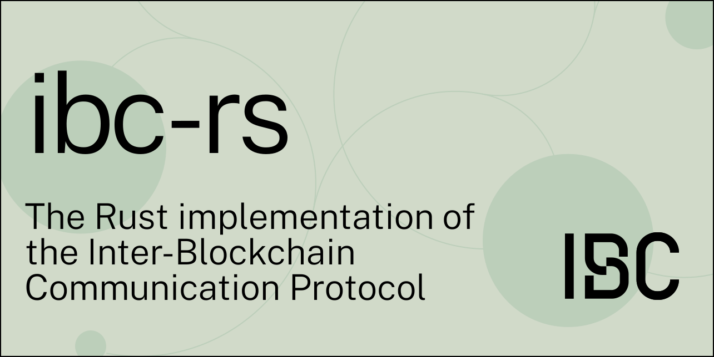

    <h1>IBC in Rust</h1>

[![Crate][crate-image]][crate-link]
[![Docs][docs-image]][docs-link]
[![Build Status][build-image]][build-link]
[![Apache 2.0 Licensed][license-image]][license-link]
![Version][crates-io-version]
![Downloads][crates-io-downloads]
![Rust Stable][msrv-image]

Implementation of the Inter-Blockchain Communication Protocol ([IBC]) in Rust.
This crate serves as one-stop shop library re-exporting data structures and
implementations of various IBC core, clients and applications from the
[`ibc-core`](../ibc-core), [`ibc-clients`](../ibc-clients) and
[`ibc-apps`](../ibc-apps) crates.

## Documentation

See documentation on [docs.rs][docs-link].

## Contributing

IBC is specified in English in the [cosmos/ibc
repo](https://github.com/cosmos/ibc). Any protocol changes or clarifications
should be contributed there.

If you're interested in contributing, please take a look at the
[CONTRIBUTING](./../CONTRIBUTING.md) guidelines. We welcome and appreciate
community contributions!

## License

Copyright © 2021 Informal Systems Inc. and `ibc-rs` authors.

Licensed under the Apache License, Version 2.0 (the "License"); you may not use
the files in this repository except in compliance with the License. You may
obtain a copy of the License at

    https://www.apache.org/licenses/LICENSE-2.0

Unless required by applicable law or agreed to in writing, software distributed
under the License is distributed on an "AS IS" BASIS, WITHOUT WARRANTIES OR
CONDITIONS OF ANY KIND, either express or implied. See the License for the
specific language governing permissions and limitations under the License.

[//]: # (badges)

[crate-image]: https://img.shields.io/crates/v/ibc.svg
[crate-link]: https://crates.io/crates/ibc
[docs-image]: https://docs.rs/ibc/badge.svg
[docs-link]: https://docs.rs/ibc/
[build-image]: https://github.com/cosmos/ibc-rs/workflows/Rust/badge.svg
[build-link]: https://github.com/cosmos/ibc-rs/actions?query=workflow%3ARust
[license-image]: https://img.shields.io/crates/l/ibc
[license-link]: https://github.com/cosmos/ibc-rs/blob/main/LICENSE
[crates-io-version]: https://img.shields.io/crates/v/ibc.svg
[crates-io-downloads]: https://img.shields.io/crates/d/ibc.svg
[msrv-image]: https://img.shields.io/crates/msrv/ibc

[//]: # (general links)

[IBC]: https://github.com/cosmos/ibc
